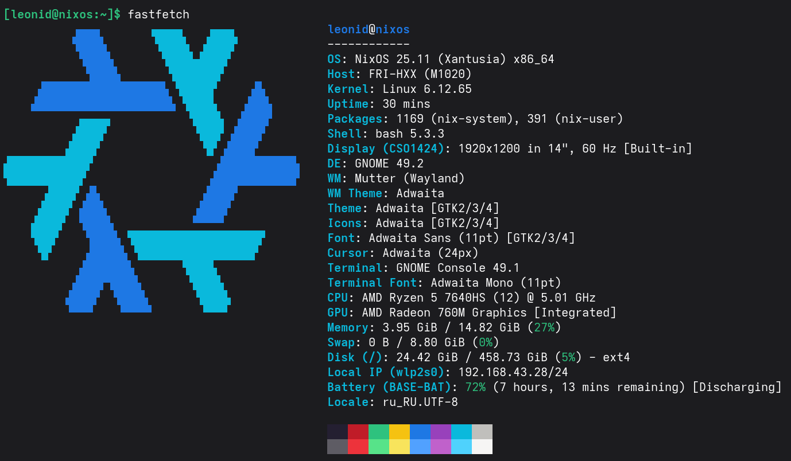

# Конфигурация NixOS
> [!WARNING]  
> **ВАЖНО:** Это моя персональная конфигурация. Она может сломать Вашу систему, стереть данные или вызвать пробуждение Ктулху. Используйте на свой страх и риск. Я не несу ответственности за любой ущерб, вызванный использованием этих файлов.



Конфигурация написана для ноутбука: **HONOR MagicBook X14 2024**

# Полезная информация
## Установка **home-manager**
```bash
sudo nix-channel --add https://github.com/nix-community/home-manager/archive/release-25.11.tar.gz home-manager
sudo nix-channel --update
```

## Форматирование кода
```bash
sudo nixfmt **/*.nix
```
